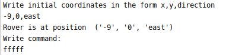

## Mars Rover Kata
###### MartiX, like SpaceX we explore Marte
###### Version: 1.2, Last updated: 2020-10-26

----
Move an object in the two-dimensional space, giving to it
proper instructions.
- The object have initial and final coordinates `(x,y, direction)`
- direction can be one of the follows` [EAST,WEST]`
- The instruction is a command like `F` (Move forward)
----
 
------------

###### Requirements
 - to have installed python3.x.x

### Run App:
In a terminal, inside the martix folder:
`python3 app.py`

Insert coordinates in the form `3,4,EAST`

Insert command in the form `F`
you can write as many 'F' as you want

To interrupt console: CTRL+C

##### Run Test Coverage
 Install pip if you don't have it  and then:
 
`cd martix`

`python3 -m venv .env_martix`

`source .env_martix/bin/activate`

`pip3 install -r requirements.txt`
 
` python3 -m pytest tests/ -v --cov command`

###### Deactivate the virtual env

`deactivate`

#### Future releases
- To be able to move also in the ordinate axis (y) (NORTH,SOUTH)